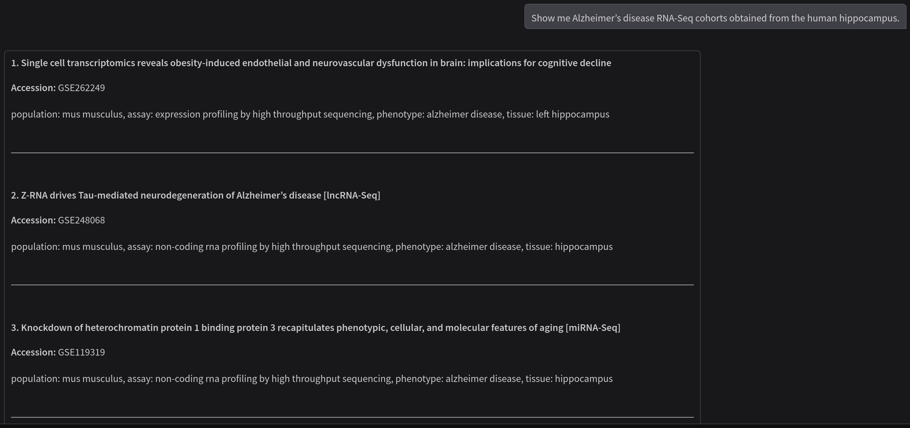
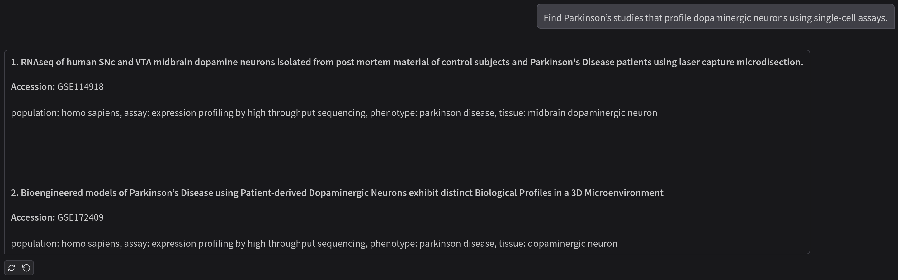
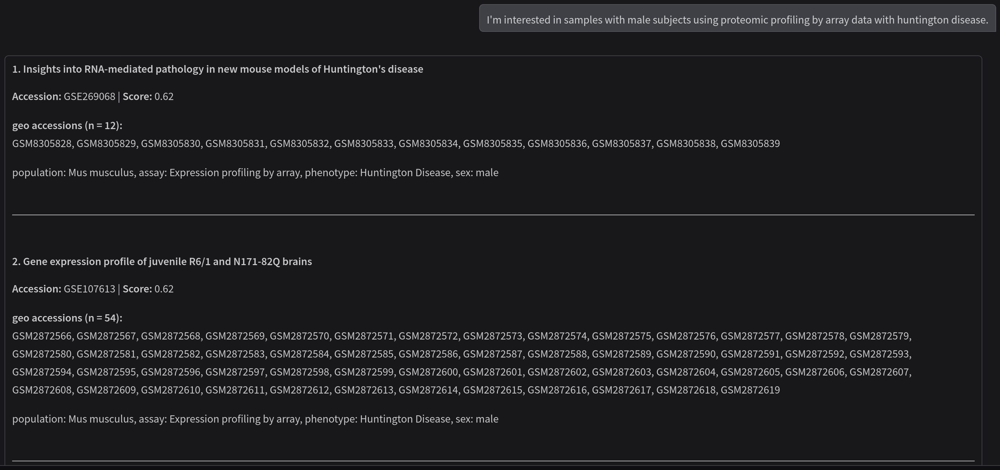

# NeuroEmbed

NeuroEmbed is an ontology-augmented embedding approach that transforms Gene Expression Omnibus (GEO) neurodegeneration studies into a coherent and searchable atlas. It aligns free-text metadata with biomedical ontologies and maps each cohort into a dense semantic space. NeuroEmbed allows researchers to express natural-language queries such as:

- Show me Alzheimer’s disease RNA-Seq cohorts obtained from the human hippocampus.

- Find Parkinson’s studies that profile dopaminergic neurons using single-cell assays.

- I'm interested in samples with male subjects using proteomic profiling by array data with huntington disease.

Within milliseconds, NeuroEmbed returns ranked GEO accessions, enriched cohort descriptors, and direct links to the original records—eliminating the need for ad-hoc keyword tricks or manual spreadsheet filtering.

NeuroEmbed is available [here](http://155.54.95.169:8501/).

NeuroEmbed repository is available [here](http://155.54.95.169:8501/). 

NeuroEmbed uses a Gradio interface. Users simply type a question, receive streamed results in the browser, and can drill down to sample-level details. The prototype runs on a fine-tuned PubMedBERT encoder trained on 368k question–cohort pairs. NeuroEmbed achieves a mean retrieval precision of 0.87 and resolves four-term queries with perfect accuracy across our 2,801 cohorts and 150,924 samples. Ongoing work is extending coverage to complete sample metadata and multi-omics signatures, so that future queries can combine clinical metadata with molecular similarity.

For more information about the methodology behind NeuroEmbed, please see our [preprint](https://arxiv.org/abs/2506.13467).

## Screenshots

Below are example screenshots of NeuroEmbed in action:

  
*Query example: Show me Alzheimer's disease RNA-Seq cohorts obtained from the human hippocampus.*

  
*Query example: Find Parkinson's studies that profile dopaminergic neurons using single-cell assays.*

  
*Query example: I'm interested in samples with male subjects using proteomic profiling by array data with huntington disease.*